# Getting started with Azure CLI

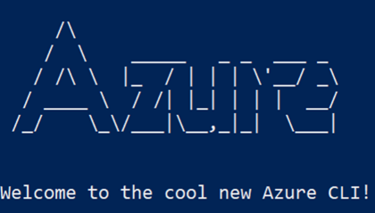


---------------------------------------------------------


## Requirements
- Microsoft Azure Account ( with funds or credits    )
- Microsoft Azure Suscription
- A Windows, Linux or Mac system
- A web browser
- Access to internet
- Azure CLI installed on your system ([here's the official guide](https://docs.microsoft.com/en-us/cli/azure/install-azure-cli))
- Installed SSH (optional)

---------------------------------------------------------

## Creating your VM
#### 1. Open your terminal.

#####    Windows
Press the **Windows** key and type *cmd*, then click on *Command prompt*.

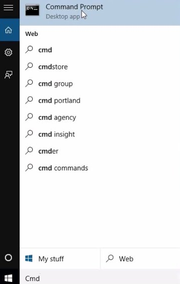

#####    Mac
Press **Command + Spacebar** and type *terminal*, then click on it.

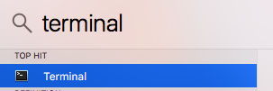

####    Linux
This will depend a lot on the distribution you're using, however, for most desktop distributions the shortcut to open a command line is **Ctrl + Alt + T**.

#### 2. Type the following command and press enter:

```Bash
az login
```

#### 3. A new browser window will appear, just login to your Microsoft Azure account. If your logged in succesfully, the following message will appear:

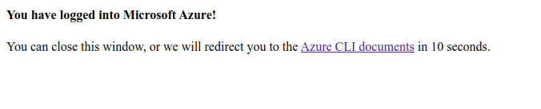

#### 4. We will now create a new resource group. Type the following command in order to do so:

```Bash
az group create --location uksouth --name cli-resource-group
```

#### 5. In order to see your resource groups, you will need to type the following command:

```Bash
az group list
```

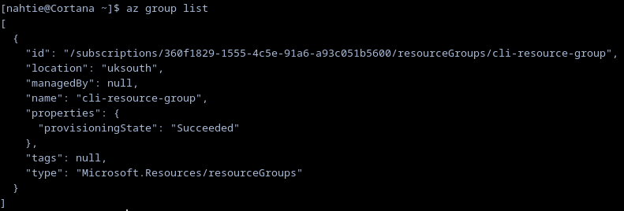

#### 6. We can also see our resource groups using the [Azure Portal](https://portal.azure.com/#home). Once you're inside your dashboard, click on the searchbar and type *Resource groups*, then click on it.

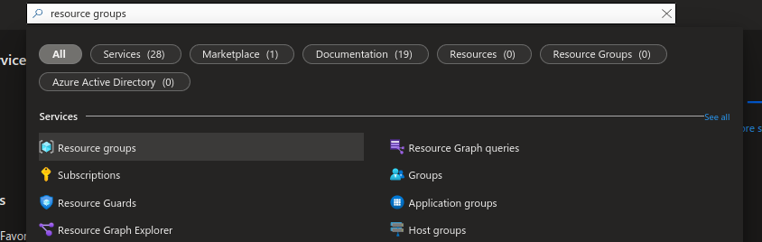
#### 7. You will now see all of your resource groups, including the one you just created using Azure CLI.

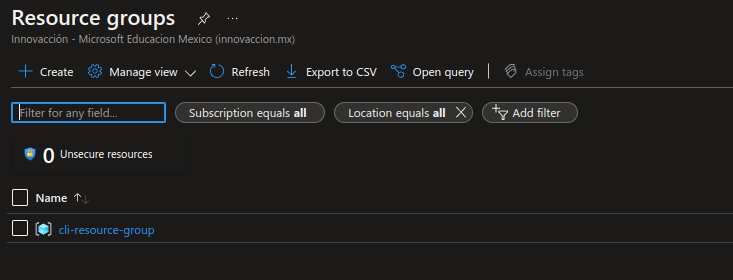
#### 8. We will now create a VM inside the resource group. Go back to your terminal and insert the following command:

```Bash
az vm create --resource-group cli-resource-group --name myVM --image Debian --admin-username azureuser --generate-ssh-keys
```

#### This may take a couple of seconds or minutes.
#### 9. In order to confirm that you created your VM succesfully, you can type the following command:

```Bash
az resource list --resource-group cli-resource-group
```

#### Alternatively, you can check it inside the Azure Portal by clicking on your resource group:


### EXTRA: connecting to your VM using SSH:
#### 1. You will first need to find out your VM's public IP address, to do so, insert the following command:

```Bash
az vm list-ip-addresses --resource-group cli-resource-group
```

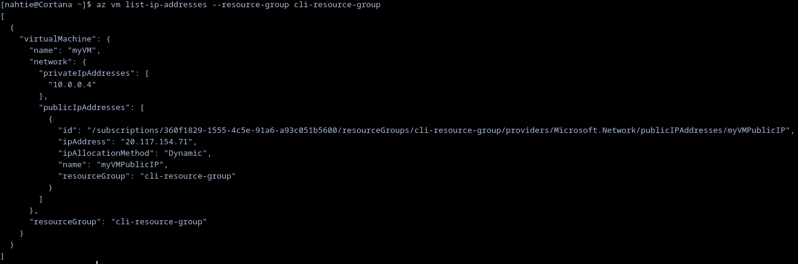

#### 2. Identify your VM's public IP address.

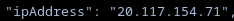

#### 3. Insert the following command, but replace *IPADDRESS* with your VM's public IP.
```Bash
ssh azureuser@IPADDRESS
```

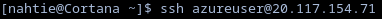

#### 4. Congratulations! You are now connected to your VM!

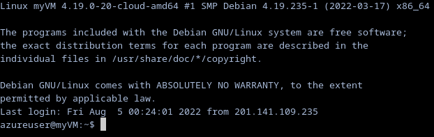

#### 5. In order to exit from your VM and go back to your regular terminal, just type *exit*.
```Bash
exit
```

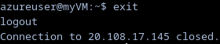

## Deleting your resources
#### 1. Once we remove your resource group, the VM inside it will also be deleted. Insert the following command to remove your resource group, then, press *y* and enter (this may take some time).
```Bash
az group delete -n cli-resource-group
```

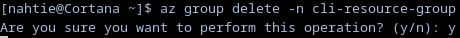

#### 2. Let's list our resource groups again to check that it isn't there.
```Bash
az group list
```

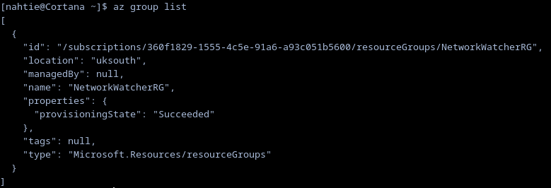

#### 3. As you can see, our resource group (*cli-resource-group*) has been deleted, however, we do have another resource group called *NetworkWatcherRG*; this resource group was created when we created our VM. I don't need it for any of my resources, so I'll be removing it as well. 
```Bash
az group delete -n NetworkWatcherRG
```

---------------------------------------------------------

## Congratulations ! You've used the Azure CLI to deploy, read and delete resources !
Don't forget to delete or turn off your resources when you you're done with them !
